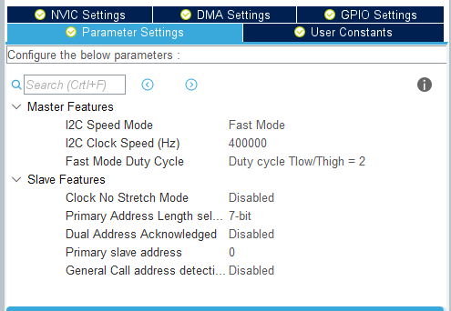

# STM32 HAL library for GY-521 (MPU6050) with Kalman filter

## English note

A simple C library (STM32 HAL) for working with the GY-521 module (MPU6050) <https://www.aliexpress.com/af/gy%25252d521.html?trafficChannel=af&d=y&CatId=0&SearchText=gy-521&ltype=affiliate&SortType=total_tranpro_desc&groupsort=1&page=1>

Start and initialize the I2C bus using the STM32CubeMX.



Configure STM32CubeMX by setting "General peripheral Initalizion as a pair of '.c / .h' file per peripheral" in the project settings.

Copy the library header and source file to the appropriate project directories (Inc, Src).

In the head file of your project (`main.c`), include the header file

```c
/ * USER CODE BEGIN Includes * /
#include "mpu6050.h"
/ * USER CODE END Includes * /
```

add structure to the section

```c
/ * USER CODE BEGIN PV * /
MPU6050_t MPU6050;
/ * USER CODE END PV * /
```

add int main (void) to the function section

```c
/ * USER CODE BEGIN 2 * /

while (MPU6050_Init(&hi2c1) == 1);

/ * USER CODE END 2 * /
```

for initial initialization of the GY-521 (MPU6050).

add int main (void) to the function section

```c
/ * USER CODE BEGIN WHILE * /
while (1)
{
/ * USER CODE END WHILE * /

/ * USER CODE BEGIN 3 * /
  MPU6050_Read_All(&hi2c1, &MPU6050);
  HAL_Delay (100);
}
/ * USER CODE END 3 * /
```

On this project setup is ready.
After starting the program, information from the GY-521 (MPU6050) will be available through the MPU6050 structure

```c
MPU6050.KalmanAngleX
```

The Kalman filter algorithm for calculating angles is taken from the project <https://github.com/TKJElectronics/KalmanFilter>
